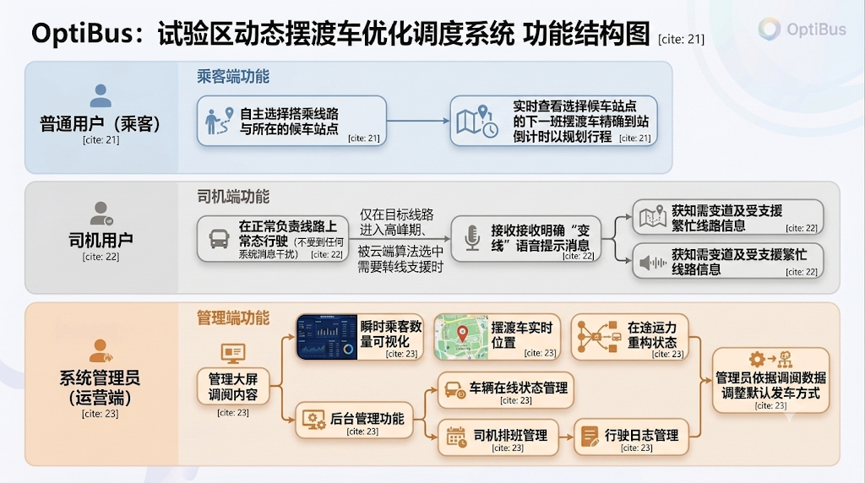
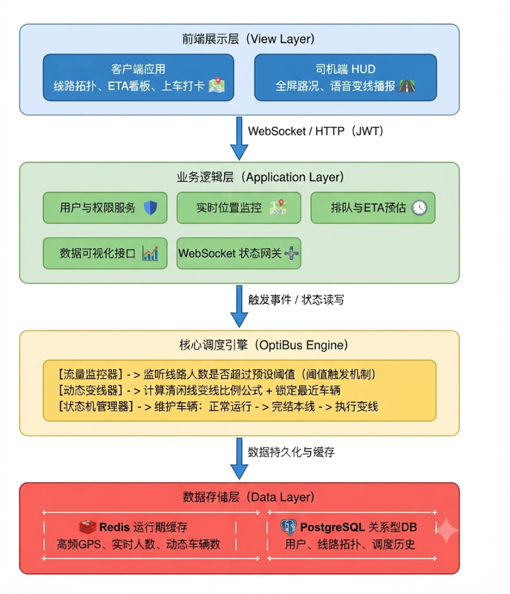
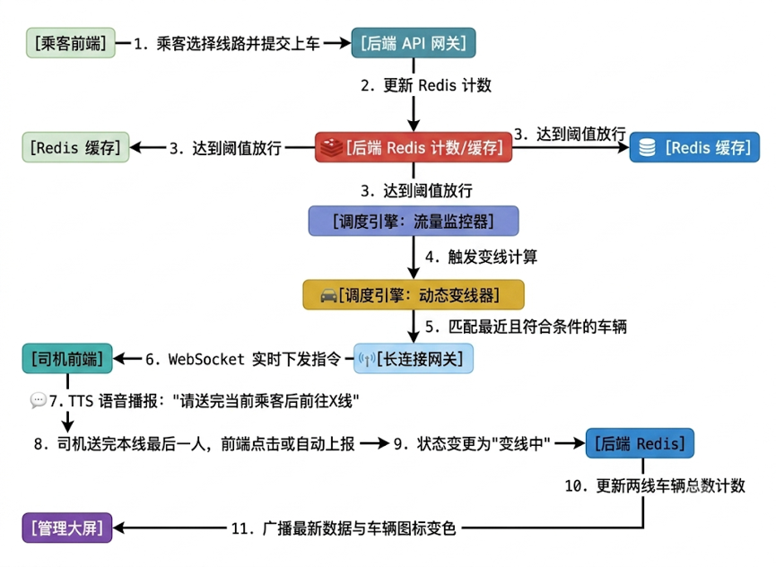

## 1. 项目背景与真实需求
填写提示：说明项目面向谁、解决什么具体问题、现有方式有哪些不足，以及项目的实际使用场景。建议300—500字。

### 1.1 面向对象：海南陵水黎安国际教育创新试验区内的全体师生、后勤人员（乘客）以及摆渡车运营团队（司机与调度端）。

### 1.2 项目背景与现有不足：园区现行的"固定路线、固定班次"传统公交模式，难以应对校园强烈的"潮汐式"客流波动。
- 1. 供给端资源错配：据本小组实地调研，在乘车高峰期（如大太阳和雨水天气、上下学时段）一号线这条核心线路严重满载溢出，而边缘线路车辆少量空转。而司机目前仅靠对讲机互相调度各线路车辆"互帮互助"，存在设备不足、信号不清及行车安全隐患。
- 2. 需求端信息黑盒：乘客无法获取精准的摆渡车动态到站时间，无法合理规划行程，极端天气下的高并发候车严重降低了校园出行体验。

### 1.3 解决的具体问题： 本项目通过构建"端到端"的需求响应式柔性调度系统，重点解决两大痛点：
- 1. 消解信息不对称：利用实时地理位置与数据流，为乘客提供候车时精准的车辆到站动态倒计时。
- 2. 动态运力重构：重构底层算法，摒弃传统的盲目变线或口头对讲，基于瞬时客流热力分布，在极短时间窗口内自动计算出最优车辆调度方案并直接反馈给摆渡车司机（不需要摆渡车司机主动请求），实现运力在不同线路间的智能转线与柔性互帮。

### 1.4 应用场景： 在有乘车出行需求时，乘客可在用户端一键获取车辆到站时间，合理安排出行计划；同时，司机端在无需分神交互的动态导航下，自动接收云端算法的调度指令，无缝完成由"清闲线路"向"高并发线路"的支援。


## 2. 用户角色与功能需求
填写提示：列出管理员、普通用户及其他角色；说明各角色能够执行的操作；可附功能结构图或用户流程图。

### 2.1 用户角色与其操作：系统围绕"需求响应式柔性调度"的核心逻辑，通过打通多端数据闭环，定义了三类核心角色，并针对其各自的业务场景设计了相应的功能需求。
- 1. 普通用户（乘客）：属于系统的需求发起方。可执行的操作包括：自主选择要搭乘的线路和所在的候车站点；实时查看选择的候车站点的下一班摆渡车的精确到站倒计时以规划行程。
- 2. 司机用户：负责驾驶摆渡车，属于系统的运力执行方。可执行的操作包括：在正常负责的线路上照常行驶，不受到任何系统消息与弹窗的干扰；仅在目标线路进入高峰期、被云端算法选中需要转线支援时，接收到"变线"的明确语音提示消息，直接获知自己需要变道以及需要转线至哪一条受支援的繁忙线路。
- 3. 系统管理员（运营端）：负责全局的交通监管与控制。可执行的操作包括：通过管理大屏直观调阅全园区各线路的瞬时乘客数量、各摆渡车的实时位置及在途运力重构状态；在后台对车辆在线状态、司机排班及行驶日志进行管理；管理员可参考以上调阅内容进行默认发车方式的调整。

### 2.2 功能结构图



## 3. 系统总体架构
填写提示：说明前端、后端、数据库、第三方服务或AI模块之间的关系；附系统架构图、数据流图和项目目录结构。

### 3.1 模块关系描述
OptiBus 系统采用 B/S 架构，通过实时数据双向通信实现需求响应式柔性调度。系统模块协作关系如下：
- 1. 前端（Frontend）：分为"乘客交互端"、"司机驾驶端"与"管理员端"。前端利用WebSocket与后端保持长连接，实现GPS位置的秒级上传与调度指令的实时接收。
- 2. 后端（Backend）：作为系统大脑，负责处理来自前端的业务逻辑请求，维护车辆状态机（正常/待变线/变线中），并执行核心调度算法。
- 3. 数据库（Database/Cache）：采用Redis处理高频的GPS位置信息与实时乘客计数（内存级性能）；采用PostgreSQL持久化线路、站点、用户权限及调度历史日志。
- 4. 调度引擎（AI/调度模块）：实时监控线路客流。当线路负载超过阈值时，自动计算最优车辆派遣比例，并向指定车辆发送变线指令。

### 3.2 系统架构图


### 3.3 数据流示意图


### 3.4 项目目录结构
```
OptiBus/
├── README.md                          # 项目总说明：介绍、快速启动、分工与设计思路
├── requirements.txt                   # Python 后端依赖清单
├── .env                               # 环境变量（数据库连接串、Redis地址等敏感信息）
├── .gitignore                         # Git 忽略规则
│
├── backend/                           # 后端源码（FastAPI）
│   ├── main.py                        # 可选的备用启动入口（FastAPI 应用工厂）
│   ├── optibus.db                     # SQLite 本地开发数据库文件
│   └── app/
│       ├── __init__.py
│       ├── main.py                    # ★ 核心主入口：包含 ETA 算法、调度引擎、发车模拟器、
│       │                              #    HTTP 接口、WebSocket 路由及 lifespan 生命周期管理
│       ├── database.py                # 数据库连接配置：PostgreSQL(SQLAlchemy) + Redis 连接池
│       ├── models.py                  # ORM 模型定义（User / Route / Station / DispatchLog）
│       ├── schemas.py                 # Pydantic 数据校验模型（请求/响应 DTO）
│       ├── websocket.py               # WebSocket 连接管理器：按角色(司机/乘客)管理长连接池
│       ├── api/
│       │   ├── __init__.py            # 路由模块注册
│       │   └── routes.py              # RESTful API 路由骨架（乘客/司机/管理员接口占位）
│       ├── core/
│       │   └── scheduler.py           # 调度算法引擎（比例计算、最近车辆筛选函数骨架）
│       └── models/
│           ├── __init__.py            # 模型包初始化
│           └── bus_models.py          # 公交领域模型文件（预留扩展）
│
├── frontend/                          # 前端源码（Vue3 + Vite）
│   ├── index.html                     # SPA 入口 HTML
│   ├── package.json                   # 前端依赖配置（Vue3/Vite/Pinia/TailwindCSS/Axios）
│   ├── vite.config.js                 # Vite 构建配置（含 /api 与 /ws 代理到后端 :8000）
│   ├── tailwind.config.js             # TailwindCSS 配置（扫描 src/**/*.{vue,js}）
│   ├── postcss.config.js              # PostCSS 配置
│   └── src/
│       ├── main.js                    # Vue 应用入口：挂载 App、注册 Router
│       ├── App.vue                    # 根组件（仅含 <router-view>）
│       ├── style.css                  # TailwindCSS 基础指令
│       ├── api/
│       │   ├── index.js               # ★ HTTP 接口封装（Axios 实例 + 乘客/司机/管理员三端 API）
│       │   ├── request.js             # Axios 实例（备用，指向 8080）
│       │   └── busService.js          # 车辆服务 API（位置查询 / ETA / 调度指令）
│       ├── router/
│       │   └── index.js               # ★ Vue Router 路由表 + 导航守卫（角色权限校验）
│       ├── store/
│       │   └── bus.js                 # ★ Pinia 状态管理（车辆位置、客流热力、变线记录）
│       ├── utils/
│       │   ├── websocket.js           # ★ WebSocket 客户端工具（断线重连、消息订阅/发送）
│       │   └── tts.js                 # ★ 语音 TTS 播报工具（Web Speech API 封装）
│       ├── components/
│       │   ├── MapCanvas.vue          # ★ 核心组件：SVG 园区路网拓扑图（站点定位、线路绘制、交互动画）
│       │   ├── Header.vue             # 公共头部组件（OptiBus 标题栏）
│       │   ├── BusIcon.vue            # 车辆图标组件（按坐标百分比定位）
│       │   └── StationCircle.vue      # 站点圆圈组件（圆形标记 + 站点名）
│       ├── views/
│       │   ├── PassengerView.vue      # ★ 乘客选站终端：站点选择 → 线路确认 → 候车倒计时
│       │   ├── DriverView.vue         # ★ 司机驾驶终端：当前任务展示 + 调度语音播报模拟
│       │   ├── AdminView.vue          # ★ 管理员总控台：实时监控看板 / 车辆排班 / 运力预警
│       │   ├── LoginView.vue          # 统一登录页（管理员 / 司机双角色认证）
│       │   └── HomeView.vue           # 首页入口（乘客 / 司机入口选择）
│       └── assets/
│           └── campus-map.png         # 园区地图静态资源
│
├── database/                          # 数据库设计文件
│   ├── schema.sql                     # ★ 数据库初始化 SQL（6 张表）
│   └── seed_data.json                 # 初始种子数据（3 条线路、10 个站点、5 辆车、5 位司机）
│
└── docs/                              # 课程验收文档
    ├── SystemArchitecture.md          # 系统总体架构说明文档
    └── VibeLogs/
        └── vibe_log_01.md             # 项目迭代日志（Day 1：技术选型与项目初始化）
```


## 4. 技术选型与环境
填写提示：说明选择相关框架、数据库和工具的原因；列出操作系统、运行环境、关键依赖和版本。

### 4.1 技术选型总览

| 层级 | 技术 | 版本 | 选型理由 |
|------|------|------|----------|
| **前端框架** | Vue 3 (Composition API) | 3.4.0 | 响应式 SPA，`<script setup>` 语法简洁，适合三端视图快速开发 |
| **构建工具** | Vite | 5.0.0 | 基于 ESBuild 的极速 HMR，开发体验优于 Webpack |
| **CSS 框架** | TailwindCSS | 3.4.19 | 原子化 CSS，无需手写样式文件，适合快速迭代 UI |
| **状态管理** | Pinia | 2.1.0 | Vue3 官方推荐，TypeScript 友好，模块化设计 |
| **路由** | Vue Router | 4.2.0 | SPA 页面切换 + 导航守卫实现角色权限控制 |
| **HTTP 客户端** | Axios | 1.18.1 | Promise 封装，拦截器支持，比 fetch 更丰富的配置项 |
| **后端框架** | FastAPI | 0.104.1 | Python 异步 Web 框架，原生支持 WebSocket、自动生成 OpenAPI 文档 |
| **ASGI 服务器** | Uvicorn | 0.24.0 | 高性能异步服务器，支持 WebSocket 长连接 |
| **ORM** | SQLAlchemy | 2.0.23 | Python 最成熟的 ORM，支持 PostgreSQL 方言，声明式模型定义 |
| **数据校验** | Pydantic | 2.5.2 | FastAPI 原生集成，自动请求校验与序列化 |
| **持久化数据库** | PostgreSQL | — | 成熟的关系型数据库，支持复杂查询与事务，适合生产环境持久化存储 |
| **缓存数据库** | Redis | 5.0.1 | 内存级读写性能（微秒级），适合高频 GPS 位置更新与实时乘客计数 |
| **实时通信** | WebSocket | 12.0 (websockets) | 全双工长连接，承载司机 GPS 秒级上传与调度指令实时推送 |
| **语音播报** | Web Speech API | 浏览器内置 | 零依赖，浏览器原生 TTS 引擎，支持中文语音播报 |
| **环境变量** | python-dotenv | 1.0.0 | 从 .env 文件加载数据库连接串等敏感配置 |

### 4.2 操作系统与运行环境

| 项目 | 要求 |
|------|------|
| **操作系统** | Windows 10+ / macOS 12+ / Linux (Ubuntu 20.04+) |
| **Python** | 3.10+（推荐 3.11/3.12） |
| **Node.js** | 18.0+（推荐 20 LTS） |
| **PostgreSQL** | 14.0+（或使用 SQLite 作为开发环境替代） |
| **Redis** | 6.0+ |
| **包管理器** | pip（Python）/ npm（Node.js） |

### 4.3 关键依赖版本清单

**Python（[requirements.txt](requirements.txt)）：**
```
fastapi==0.104.1          # Web 框架
uvicorn[standard]==0.24.0 # ASGI 服务器
sqlalchemy==2.0.23        # ORM
pydantic==2.5.2           # 数据校验
python-dotenv==1.0.0      # 环境变量
websockets==12.0          # WebSocket 协议支持
redis==5.0.1              # Redis 客户端
```

**Node.js（[frontend/package.json](frontend/package.json)）：**
```
vue: ^3.4.0               # 前端框架
vite: ^5.0.0              # 构建工具
pinia: ^2.1.0             # 状态管理
vue-router: ^4.2.0        # 路由
axios: ^1.18.1            # HTTP 客户端
tailwindcss: ^3.4.19      # CSS 框架
@vitejs/plugin-vue: ^4.5.0
```


## 5. 数据库与数据对象设计
填写提示：列出主要表或集合、关键字段、主外键/关联关系；说明数据从哪里产生、如何保存、如何更新。可直接贴数据表。

### 5.1 数据存储架构

系统采用 **双层存储架构**：PostgreSQL（持久化）+ Redis（实时缓存），各司其职：

- **PostgreSQL**：存储用户、线路、站点、调度日志等结构化业务数据，支持复杂 SQL 查询与事务。
- **Redis**：存储车辆实时位置、各线路在线车辆数/乘客数、乘客生命周期等高频读写数据，利用 Hash 结构实现原子计数。

### 5.2 持久化层 — 数据库表设计

建表语句详见 [database/schema.sql](database/schema.sql)，共 6 张表：

#### 5.2.1 线路表（routes）

| 字段名 | 类型 | 约束 | 说明 |
|--------|------|------|------|
| id | INTEGER | PK, AUTOINCREMENT | 线路唯一 ID |
| name | VARCHAR(64) | NOT NULL | 线路名称（如"1号线 - 教学区环线"） |
| color | VARCHAR(16) | DEFAULT '#3388FF' | 线路标识颜色（前端 SVG 渲染用） |
| status | TINYINT | DEFAULT 1 | 状态：1=启用, 0=停用 |
| created_at | DATETIME | DEFAULT CURRENT_TIMESTAMP | 创建时间 |
| updated_at | DATETIME | DEFAULT CURRENT_TIMESTAMP | 更新时间 |

#### 5.2.2 站点表（stations）

| 字段名 | 类型 | 约束 | 说明 |
|--------|------|------|------|
| id | INTEGER | PK, AUTOINCREMENT | 站点唯一 ID |
| route_id | INTEGER | FK → routes.id, NOT NULL | 所属线路 |
| name | VARCHAR(64) | NOT NULL | 站点名称 |
| latitude | DOUBLE | NOT NULL | 纬度坐标 |
| longitude | DOUBLE | NOT NULL | 经度坐标 |
| seq_order | INTEGER | DEFAULT 0 | 在线路中的停靠顺序 |
| created_at | DATETIME | DEFAULT CURRENT_TIMESTAMP | 创建时间 |

#### 5.2.3 车辆表（buses）

| 字段名 | 类型 | 约束 | 说明 |
|--------|------|------|------|
| id | INTEGER | PK, AUTOINCREMENT | 车辆唯一 ID |
| plate | VARCHAR(16) | NOT NULL, UNIQUE | 车牌号 |
| route_id | INTEGER | FK → routes.id | 当前所属线路 |
| latitude | DOUBLE | — | 实时纬度 |
| longitude | DOUBLE | — | 实时经度 |
| status | TINYINT | DEFAULT 0 | 状态：0=离线, 1=在线, 2=行驶中, 3=变线中 |
| driver_id | INTEGER | — | 当前司机 ID |
| updated_at | DATETIME | DEFAULT CURRENT_TIMESTAMP | 最后位置更新时间 |

#### 5.2.4 司机表（drivers）

| 字段名 | 类型 | 约束 | 说明 |
|--------|------|------|------|
| id | INTEGER | PK, AUTOINCREMENT | 司机唯一 ID |
| name | VARCHAR(32) | NOT NULL | 司机姓名 |
| phone | VARCHAR(16) | — | 手机号 |
| status | TINYINT | DEFAULT 0 | 状态：0=离线, 1=在线, 2=出车中 |
| created_at | DATETIME | DEFAULT CURRENT_TIMESTAMP | 创建时间 |

#### 5.2.5 行驶日志表（trip_logs）

| 字段名 | 类型 | 约束 | 说明 |
|--------|------|------|------|
| id | INTEGER | PK, AUTOINCREMENT | 日志唯一 ID |
| bus_id | INTEGER | FK → buses.id, NOT NULL | 车辆 ID |
| driver_id | INTEGER | FK → drivers.id, NOT NULL | 司机 ID |
| route_id | INTEGER | FK → routes.id, NOT NULL | 实际行驶线路 |
| start_time | DATETIME | NOT NULL | 出车时间 |
| end_time | DATETIME | — | 收车时间 |
| mileage | DOUBLE | DEFAULT 0 | 行驶里程（km） |
| passenger_count | INTEGER | DEFAULT 0 | 载客数 |

#### 5.2.6 候车记录表（wait_records）

| 字段名 | 类型 | 约束 | 说明 |
|--------|------|------|------|
| id | INTEGER | PK, AUTOINCREMENT | 记录唯一 ID |
| station_id | INTEGER | FK → stations.id, NOT NULL | 候车站点 |
| user_id | VARCHAR(64) | — | 匿名用户标识 |
| wait_seconds | INTEGER | NOT NULL | 候车时长（秒） |
| recorded_at | DATETIME | DEFAULT CURRENT_TIMESTAMP | 记录时间 |

### 5.3 实时缓存层 — Redis 数据结构设计

系统在 Redis 中维护以下核心数据结构（均在 [backend/app/main.py](backend/app/main.py) 中定义与操作）：

| Key | 类型 | 说明 | 写入者 | 读取者 |
|-----|------|------|--------|--------|
| `bus:status:all` | Hash | 全网车辆实时状态。Key=busId，Value=JSON（含 lat/lng/route_key/status/original_route_key/pending_return） | 司机 WebSocket GPS 上报 / 调度引擎 | ETA 接口 / 车辆位置接口 / 调度引擎 |
| `route:bus_count` | Hash | 各线路当前在线车辆数。Key=route_key，Value=整数 | 司机签到 / 调度引擎原子增减 | 调度引擎（判断拥挤度） |
| `route:fixed_bus_count` | Hash | 各线路原始固定配车数（仅首次初始化写入） | lifespan 启动时 | 调度引擎（归还判断） |
| `route:user_count` | Hash | 各线路当前排队候车人数。Key=route_key，Value=整数 | 乘客 join/leave 接口 | 调度引擎 / 管理端 |
| `user:lifecycle:{passenger_id}` | String | 乘客生命周期记录（JSON：passenger_id/route_key/station_id/join_time） | 乘客 join 接口 | 过期清理扫描器 |
| `route:buses:{route_id}` | Set | 某线路下的司机 ID 集合 | 司机签到接口 | 未大量使用 |

### 5.4 ORM 模型（Python 层 — [backend/app/models.py](backend/app/models.py)）

后端通过 SQLAlchemy 定义了四张核心表的 ORM 模型，与数据库表结构对应：

| ORM 类 | 对应表 | 核心字段 | 关联关系 |
|--------|--------|----------|----------|
| `User` | users | id, username(UK), role, status | — |
| `Route` | routes | id, route_name, default_bus_count | → stations (1:N), → dispatch_logs (from/to, 1:N) |
| `Station` | stations | id, route_id(FK), station_name, sequence, latitude, longitude | → Route (N:1) |
| `DispatchLog` | dispatch_logs | id, bus_id, from_route_id(FK), to_route_id(FK), trigger_time, complete_time | → Route(from) + Route(to) (N:1 each) |

### 5.5 种子数据（[database/seed_data.json](database/seed_data.json)）

系统预置 3 条线路（1号线教学区环线、2号线生活区环线、3号线宿舍-图书馆专线）、10 个站点、5 辆车、5 位司机的初始配置数据。

### 5.6 核心内存数据结构（[backend/app/main.py](backend/app/main.py) 中定义）

| 常量 | 类型 | 说明 |
|------|------|------|
| `STATIONS_XY` | dict[str, tuple] | 26 个站点（含拐点）的 (x, y) 坐标（单位：米） |
| `ROUTES_SEQUENCE` | dict[str, list[str]] | 6 条线路（3 主线 × 2 方向）的站点展开数组（含拐点，索引顺序即真实行驶轨迹） |
| `REAL_ROUTES` | dict[str, list[str]] | 过滤拐点后的纯净路线数组（仅保留真实站点） |
| `BUS_FLEET` | list[dict] | 10 辆仿真公交车的编队配置（busId/route_key/departure_offset_s） |


## 6. 接口设计
填写提示：列出核心API的请求方式、路径、参数、权限要求、返回结果和异常情况。仅填写核心接口。

### 6.1 接口总览

系统 API 分为六大类：基础接口、管理员接口、司机接口、乘客生命周期接口、车辆位置/ETA 查询接口、调度状态接口，以及两条 WebSocket 长连接端点。

### 6.2 HTTP REST 接口

#### 6.2.1 基础接口

**GET `/` — 欢迎页**
- 说明：API 存活检查
- 权限：无
- 返回：`{"message": "Welcome to OptiBus backend", "status": "ok"}`

**GET `/health` — 健康检查**
- 说明：检查 PostgreSQL 与 Redis 连通性
- 权限：无
- 返回：`{"postgres": "online"|"offline", "redis": "online"|"offline"}`

**GET `/ping` — 心跳**
- 说明：最简存活探测
- 权限：无
- 返回：`{"message": "pong"}`

#### 6.2.2 管理员端接口

**POST `/api/admin/login` — 管理员登录**
- 说明：Mock 登录，直接返回 Token
- 权限：无
- 请求体：无
- 返回：`{"token": "admin_mock_token_888"}`

#### 6.2.3 司机端接口

**POST `/api/driver/check_in` — 司机每日签到出车**
- 说明：司机上班打卡，系统初始化该司机的车辆状态并登记到对应线路
- 权限：无（前端携带 driverToken 校验）
- 请求体（JSON）：
  ```json
  { "driver_id": 101, "route_id": 1 }
  ```
- 成功返回：`{"status": "ok", "driver_id": 101, "route_id": 1}`
- 内部操作：
  1. 在 Redis `bus:status:all` Hash 中以 driver_id 为 Key 写入初始状态 JSON
  2. 将 driver_id 加入 `route:buses:{route_id}` Set

#### 6.2.4 乘客生命周期接口

**POST `/api/dispatch/passenger_action` — 乘客加入/离开排队**
- 说明：乘客在站点候车（join）或取消候车（leave），触发线路人数计数更新
- 权限：无（匿名乘客）
- 请求体（JSON）：
  ```json
  {
    "passenger_id": "anon_abc123",
    "route_key": "line1_cw",
    "action": "join",
    "station_id": "图书馆"
  }
  ```
  - `action` 取值：`"join"` | `"leave"`
  - `route_key` 必须在 `ROUTES_SEQUENCE` 中存在，否则返回 error
- 成功返回（join）：
  ```json
  { "status": "ok", "action": "join", "passenger_id": "anon_abc123",
    "route_key": "line1_cw", "current_count": 5 }
  ```
- 内部操作（join）：
  1. 检查乘客是否已在其他线路（防刷），若是则从旧线路 `route:user_count` 减 1
  2. 写入 lifecycle 记录到 Redis（含 join_time）
  3. 目标线路 `route:user_count` 原子 +1
- 内部操作（leave）：
  1. 读取并删除 lifecycle 记录
  2. 对应线路 `route:user_count` 原子 -1（防负数保护）

#### 6.2.5 车辆位置与 ETA 查询接口

**GET `/api/buses/locations` — 全网车辆实时位置**
- 说明：返回所有车辆（含真车 + 仿真车）的拓扑段位信息，前端用于 SVG 地图渲染
- 权限：无
- 返回：
  ```json
  {
    "buses": [
      {
        "busId": "101",
        "line": "1号线",
        "fromStation": "中传专享楼",
        "toStation": "公共教学楼",
        "progress": 0.5,
        "status": "in-transit"
      }
    ]
  }
  ```
  - `fromStation` / `toStation`：已过滤拐点，仅展示真实站点
  - `progress`：0.0（刚离开 fromStation）/ 0.5（行驶中）/ 1.0（已到 toStation）
  - `status`：`"arrived"` | `"in-transit"`
- 实现要点：
  - 真车：从 Redis `bus:status:all` 读取 GPS 坐标，通过 `snap_vehicle()` 投影到路线段，再用 `_prev_real_station()` / `_next_real_station()` 过滤拐点
  - 仿真车：通过 `get_simulated_segment_info()` 基于 15 秒/tick 滴答器生成纯逻辑拓扑位置

**GET `/api/eta/{station_id}` — 站点 ETA 查询**
- 说明：查询指定站点最近一班车的预计到达分钟数
- 权限：无
- 路径参数：`station_id`（中文站点名，如"图书馆"）
- 成功返回：
  ```json
  { "stationId": "图书馆", "etaMinutes": 3, "busId": "103" }
  ```
- 异常返回：
  - 未知站点：`{"error": "未知站点: xxx"}`
  - 无线路经过：`{"stationId": "xxx", "etaMinutes": null, "busId": null, "message": "无线路经过此站"}`
  - 无可用车辆：`{"stationId": "xxx", "etaMinutes": null, "busId": null, "message": "暂无可用车辆"}`
- 算法流程：
  1. 查 `STATIONS_XY` 验证站点存在
  2. 通过 `build_station_route_map()` 获取经过该站的所有线路
  3. 遍历 Redis 中所有真车，对每条候选线路调用 `calculate_eta()`，取最小值
  4. 若无真车，回退到仿真车计算
  5. `calculate_eta()` 内部使用 `snap_vehicle()` 投影 + 循环遍历路线计算累积距离 / 速度

#### 6.2.6 调度状态接口

**GET `/api/dispatch/status` — 全网调度状态（调试/管理用）**
- 说明：返回每条线路的拥挤度指标及当前被调度车辆的详情
- 权限：无（开发调试用，生产应加鉴权）
- 返回：
  ```json
  {
    "routes": [
      { "route_key": "line1_cw", "user_count": 30, "bus_count": 2,
        "fixed_bus_count": 2, "health_line": 21, "overcrowded": true,
        "can_spare": false, "circle_time_s": 450.2 }
    ],
    "dispatched_buses": [
      { "busId": "103", "current_route": "line1_cw",
        "original_route": "line2_cw", "pending_return": false }
    ]
  }
  ```

### 6.3 WebSocket 长连接端点

#### 6.3.1 司机端 WebSocket — `ws://host:8000/ws/driver/{driver_id}`

- 方向：司机端 → 后端（上行 GPS 位置上报）
- 消息格式（JSON）：
  ```json
  { "lat": 18.4012, "lng": 110.0112 }
  ```
- 后端行为：
  1. 接收 JSON → Pydantic `LocationUpdate` 校验
  2. 读取 Redis 中该司机当前状态
  3. 更新 lat/lng，status 置为 "driving"
  4. 写回 `bus:status:all` Hash
- 断线处理：WebSocketDisconnect 时自动从连接管理器移除

#### 6.3.2 乘客端 WebSocket — `ws://host:8000/ws/passenger/{client_id}`

- 方向：后端 → 乘客端（下行消息推送，当前为预留通道）
- 说明：乘客端建立长连接后可接收服务端主动推送（如车辆到站提醒、调度状态变更等，当前版本仅维持连接）

### 6.4 前端 HTTP API 封装（[frontend/src/api/index.js](frontend/src/api/index.js)）

前端通过 Axios 实例（baseURL: `/api/v1`，timeout: 10s，经 Vite 代理到后端 `:8000`）封装了以下接口调用函数：

| 函数 | 方法 | 路径 | 用途 |
|------|------|------|------|
| `getRoutes()` | GET | `/routes` | 获取所有线路 |
| `getStations(routeId)` | GET | `/routes/{routeId}/stations` | 获取线路站点列表 |
| `getBusRealtime(busId)` | GET | `/buses/{busId}/realtime` | 获取车辆实时位置与 ETA |
| `getDispatch(driverId)` | GET | `/drivers/{driverId}/dispatch` | 获取司机调度指令 |
| `acceptDispatch(driverId, dispatchId)` | POST | `/drivers/{driverId}/dispatch/{dispatchId}/accept` | 司机确认接受调度 |
| `getHeatmap()` | GET | `/admin/heatmap` | 获取全网客流热力分布 |
| `getAllBuses()` | GET | `/admin/buses` | 获取所有车辆实时状态 |
| `getStats()` | GET | `/admin/stats` | 获取效能统计指标 |

### 6.5 接口权限矩阵

| 接口路径 | 乘客（匿名） | 司机 | 管理员 |
|----------|:----------:|:----:|:-----:|
| `GET /`, `/health`, `/ping` | ✅ | ✅ | ✅ |
| `POST /api/admin/login` | ✅ | ✅ | ✅ |
| `POST /api/driver/check_in` | ❌ | ✅ | ❌ |
| `POST /api/dispatch/passenger_action` | ✅ | ❌ | ❌ |
| `GET /api/buses/locations` | ✅ | ✅ | ✅ |
| `GET /api/eta/{station_id}` | ✅ | ✅ | ✅ |
| `GET /api/dispatch/status` | ❌ | ❌ | ✅ |
| `WS /ws/driver/{driver_id}` | ❌ | ✅ | ❌ |
| `WS /ws/passenger/{client_id}` | ✅ | ❌ | ❌ |


## 7. 核心功能实现
填写提示：按业务流程说明主要功能如何实现，指出关键代码文件和核心逻辑，不要求大段粘贴代码，包括特色技术深度集成。

### 7.1 ETA 动态到站时间算法

**所在文件**：[backend/app/main.py](backend/app/main.py)（第 115-174 行）

**算法流程：**

1. **坐标系**：系统维护 26 个站点（含拐点）的平面坐标 `STATIONS_XY`（单位：米），以及 6 条线路（3 主线 × 2 方向）的站点展开序列 `ROUTES_SEQUENCE`。

2. **车辆定位（`snap_vehicle`）**：给定车辆 GPS 坐标 (x, y) 和线路 route_key，遍历线路所有相邻站点对构成的线段，使用 `point_to_segment_projection()` 进行点到线段投影，找到最近的线段索引 `seg_idx` 及该车辆到该线段终点的剩余距离 `dist_to_end`。

3. **循环遍历计算**：从车辆当前段的下一个站点开始，沿线路循环遍历，累加各段的欧氏距离，直到遇到目标站点 `target_station`。将总累积距离除以 `BUS_SPEED`（8 m/s），转换为分钟数。

4. **多车取最优**：若多条线路经过同一站点，对每条线路的所有在线车辆分别计算 ETA，取最小值作为最终结果。

5. **到站判定**：若车辆与目标站点的直线距离 < `STATION_THRESHOLD`（20 米），直接返回 ETA = 0 分钟。

6. **防负保护**：`travel_time = max(0.0, elapsed_s - bus["departure_offset_s"])` 确保偏移发车时间不会产生负值。

### 7.2 需求响应式柔性调度引擎

**所在文件**：[backend/app/main.py](backend/app/main.py)（第 276-616 行）

调度引擎是整个系统的核心大脑，以后台异步任务形式运行，每 30 秒执行一次完整扫描周期。

**调度三阶段流水线：**

```
┌─────────────────┐     ┌──────────────────┐     ┌───────────────────┐
│ 阶段一：乘客过期  │ ──→ │ 阶段二：归还扫描   │ ──→ │ 阶段三：抽调扫描    │
│ 清理             │     │ (归还可脱离的车)   │     │ (从闲线抽车支援忙线) │
└─────────────────┘     └──────────────────┘     └───────────────────┘
```

**阶段一 — 乘客过期清理（`_evict_expired_passengers`）：**
- 扫描 Redis 中所有 `user:lifecycle:*` Key
- 计算每位乘客的预期停留时间 = ETA（最快车辆到站分钟数 × 60 秒）+ 线路单圈耗时（circle_time）
- 若乘客已停留超过该时长，则静默删除其 lifecycle 记录并从 `route:user_count` 减 1

**阶段二 — 归还扫描（`_check_all_return_conditions`）：**
- 遍历所有线路，检查是否已回归平稳（固定配车数 × 13 - 5 ≥ 当前乘客数）
- 若线路平稳，找到线上被调度来的车辆（含 `original_route_key` 字段），标记 `pending_return = True`
- 标记后的车辆在当前线上跑满一圈（circle_time）后，自动执行 `_execute_return()` 归还原始线路
- 归还时：恢复 route_key、清理 original_route_key/pending_return 标记、原子同步两条线路的 bus_count

**阶段三 — 抽调扫描（`_check_all_dispatch_conditions`）：**
- 遍历所有线路，检查是否超载（`_is_overcrowded`：当前人数 > bus_count × 13 - 5）
- 若某线路超载，搜索可抽调车辆的其他线路（`_can_spare_bus`：抽走一辆后自身仍能满足安全线）
- 按闲线到目标线的物理距离排序，从最近的闲线开始逐辆抽调
- 抽调执行（`_execute_dispatch`）：
  1. 在闲线上找离目标线起点最近的车辆（`_find_nearest_bus_on_route`，优先真车后仿真车）
  2. 记录 `original_route_key`，修改 `route_key` 为目标线
  3. 原子同步：闲线 bus_count -1，目标线 bus_count +1

**关键设计决策：**
- **安全余量（SAFETY_MARGIN = 5）**：拥挤判定线设在 `bus_count × 13 - 5`，即预留 5 人的缓冲空间，避免边界抖动频繁调度
- **防止调度抖动**：归还流程要求被调度车辆在当前线上跑满一圈后才归还，避免车辆刚调过去又被调回来
- **原子计数**：所有 bus_count / user_count 修改使用 Redis `HINCRBY` 原子操作，防止并发竞态

### 7.3 发车模拟器

**所在文件**：[backend/app/main.py](backend/app/main.py)（第 178-237 行）

在没有真实司机上线时，系统自动启动发车模拟器，提供 10 辆虚拟公交车的仿真数据。

**两种模拟模式：**

1. **连续物理仿真（`get_simulated_position`）**：基于 `BUS_SPEED = 8 m/s` 匀速运动模型，计算车辆在路线上的精确 (x, y) 坐标。车辆按路线段行进，到达终点后循环。支持 `departure_offset_s` 偏移量实现错峰发车。

2. **离散拓扑仿真（`get_simulated_segment_info`）**：基于 15 秒/tick 滴答器的纯逻辑模型：
   - 偶数 tick → 靠站（status="arrived"，progress=1.0）
   - 奇数 tick → 行驶中（status="in-transit"，progress=0.5）
   - 路线数组使用 `REAL_ROUTES`（已过滤拐点），确保前端展示的站点均为真实站点

### 7.4 WebSocket 实时通信

**所在文件**：[backend/app/websocket.py](backend/app/websocket.py) + [frontend/src/utils/websocket.js](frontend/src/utils/websocket.js)

**后端 — 连接管理器（`ConnectionManager`）：**
- 按角色分类管理：`active_drivers`（Dict[driver_id → WebSocket]）和 `active_passengers`（Dict[passenger_id → WebSocket]）
- 提供点对点推送（`send_to_driver`）、角色广播（`broadcast_drivers` / `broadcast_passengers`）
- 断线自动清理（`disconnect` 从池中移除）

**前端 — WebSocket 客户端：**
- 自动重连机制：`onclose` 时 3 秒后重新 `connectWS()`
- 发布/订阅模式：`onMessage(type, callback)` 注册消息监听，`sendMessage(type, payload)` 发送消息
- WebSocket URL 格式：`ws://{host}/ws/{clientType}`（clientType = "passenger" | "driver"）

**数据流向：**
```
司机端 GPS ──WebSocket──→ 后端 Redis bus:status:all ──HTTP──→ 乘客端 ETA 查询
                                                      ──HTTP──→ 管理端车辆位置
调度引擎 ──Redis bus:status:all 写入──→ 司机端（通过 WebSocket 推送变线指令）
```

### 7.5 SVG 园区路网拓扑图

**所在文件**：[frontend/src/components/MapCanvas.vue](frontend/src/components/MapCanvas.vue)

- 使用内联 SVG（viewBox="0 0 1200 700"）渲染 3 条线路、20 个站点的园区路网
- 线路绘制：SVG `<path>` 元素，每条线路独立颜色（1号线=深蓝 #102c4c，2号线=绿 #7ab829，教师专线=红 #c42126）
- 站点区分：普通站点为圆形标记，换乘枢纽站（如"中传专享楼"经过 3 条线路）为胶囊形标记
- 文字智能排版：根据站点位置自动选择文字锚点（top/bottom/left/right），避免遮挡线路
- 车辆动画：管理端视图下，使用 SVG `<animateMotion>` 驱动车辆图标沿路线循环运动
- 双模式：`isAdmin` prop 控制是否显示车辆动画（乘客端仅展示静态路网 + 可点击站点）

### 7.6 语音 TTS 播报

**所在文件**：[frontend/src/utils/tts.js](frontend/src/utils/tts.js) + [frontend/src/views/DriverView.vue](frontend/src/views/DriverView.vue)

- 使用浏览器内置 **Web Speech API**（`window.speechSynthesis`），零外部依赖
- `speakArrival(stationName, seconds)`：到站倒计时播报（"车辆预计X分钟后到达XX站"）
- `speakDispatch(instruction)`：调度指令播报（"紧急调度指令：系统检测到1号线客流拥挤……"）
- 语音参数：`lang='zh-CN'`（中文）、`rate=0.9~1.1`（语速微调）
- 司机端提供"模拟接收后台调度指令"按钮用于测试语音播报功能

### 7.7 前端路由权限守卫

**所在文件**：[frontend/src/router/index.js](frontend/src/router/index.js)

- 乘客端（`/`）：无需登录，直接访问
- 登录页（`/login`）：统一认证入口
- 管理端（`/admin`）：需 `localStorage` 中存在 `adminToken`
- 司机端（`/driver`）：需 `localStorage` 中存在 `driverToken`
- `router.beforeEach` 导航守卫在每次路由切换前校验 Token 与角色匹配，未授权则重定向至 `/login`


## 8. 登录、权限与安全边界
填写提示：说明密码哈希、角色校验、接口权限等。

### 8.1 认证机制

当前版本采用 **Mock Token 认证**，是课程演示阶段的简化实现：

| 角色 | 账号 | 密码 | Token 存储位置 | 认证方式 |
|------|------|------|---------------|----------|
| 管理员 | admin | 123456 | `localStorage.adminToken` | 前端硬编码校验 |
| 司机 | driver01 | 123456 | `localStorage.driverToken` | 前端硬编码校验 |
| 乘客 | 无 | 无 | 无（匿名访问） | 无需认证 |

**登录流程**（[frontend/src/views/LoginView.vue](frontend/src/views/LoginView.vue)）：
1. 用户在登录页输入账号密码
2. 前端组件内 `handleLogin()` 进行明文比对（硬编码 `admin` / `driver01` + `123456`）
3. 校验通过后写入对应的 localStorage Token
4. `router.push()` 跳转至对应端页面

### 8.2 权限校验

**前端层**（[frontend/src/router/index.js](frontend/src/router/index.js) 导航守卫）：
- `meta.requiresAuth` + `meta.role` 标记路由的权限要求
- 检查 `localStorage` 中是否存在对应 Token
- 未授权访问自动重定向到 `/login`

**后端层**（当前状态）：
- 后端接口当前**未实现** Token 校验中间件
- 管理员登录接口 `POST /api/admin/login` 直接返回 Mock Token，不做真实校验
- 所有 `/api/*` 接口均为开放访问

### 8.3 安全边界说明

| 安全项 | 当前状态 | 生产环境建议 |
|--------|----------|-------------|
| 密码存储 | 前端明文硬编码 | 后端 bcrypt/argon2 哈希 + 加盐 |
| Token 机制 | 前端 localStorage 存固定字符串 | JWT（含过期时间 + 签名验证） |
| 接口鉴权 | 后端无鉴权中间件 | FastAPI Depends + OAuth2PasswordBearer |
| 传输安全 | HTTP 明文 | HTTPS / TLS |
| CORS | 仅允许 `localhost:5173` | 配置为生产域名白名单 |
| 环境变量 | `.env` 文件（已 `.gitignore`） | 继续使用环境变量，不提交真实凭据 |
| 防刷 | 乘客 join 时检查是否已在其他线路 | 增加频率限制（如 1 分钟内最多 3 次 join/leave） |
| WebSocket 鉴权 | 无 Token 校验 | 连接时校验 Token（在 URL 参数或首条消息中携带） |

### 8.4 车辆状态机

系统通过 Redis `bus:status:all` 中每条记录的 `status` 字段维护车辆状态机：

```
         司机签到
    ┌──────────────┐
    │    idle      │ ← 初始状态（刚签到、未出车）
    └──────┬───────┘
           │ GPS 首次上报
    ┌──────▼───────┐
    │   driving    │ ← 正常行驶中
    └──────┬───────┘
           │ 被调度引擎抽调
    ┌──────▼───────┐
    │  dispatched  │ ← 变线支援中（含 original_route_key）
    └──────┬───────┘
           │ current_route 跑满一圈 + 原线路恢复平稳
    ┌──────▼───────┐
    │   driving    │ ← 归还原始线路（original_route_key 被清除）
    └──────────────┘
```

`pending_return` 标记作为归还过渡态：标记后车辆继续在当前线上跑满一圈，跑完后执行归还。

### 8.5 已知限制与待改进项

1. **认证系统**：当前为 Mock 实现，缺少真实的用户注册、密码哈希、JWT 签发与验证流程
2. **接口鉴权**：后端未实现统一的认证中间件，所有 API 端点均对外开放
3. **数据库一致性**：Redis 与 PostgreSQL 之间无事务同步机制，车辆位置等高频数据仅存于 Redis
4. **调度算法**：当前基于固定阈值（13 人/车）和安全余量（5 人），未引入机器学习或历史数据预测
5. **仿真保真度**：发车模拟器基于匀速模型和离散 tick，未考虑真实交通状况（拥堵、红绿灯、转弯减速）
6. **多园区扩展**：站点坐标和线路序列硬编码在 Python 源码中，改为新的园区需修改代码
